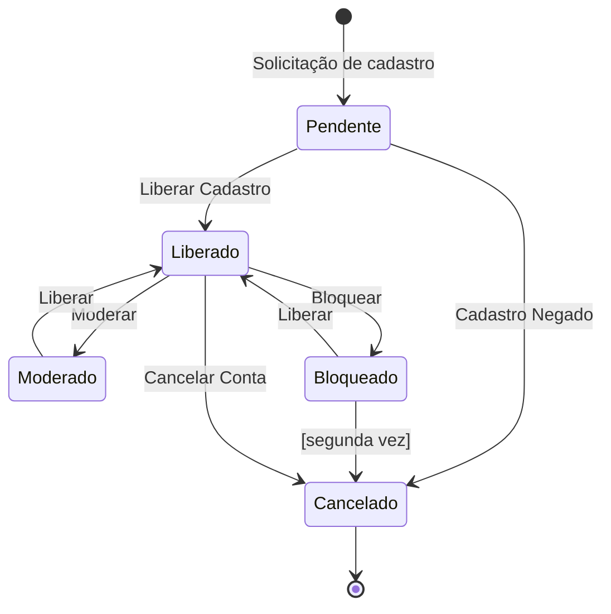
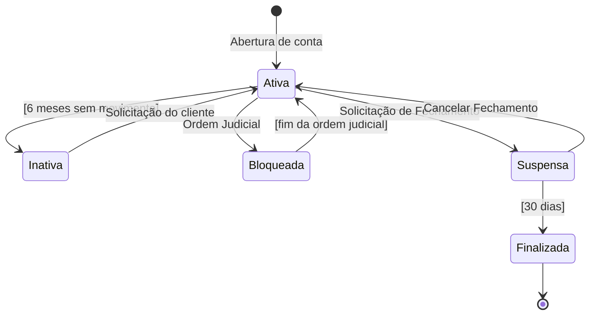
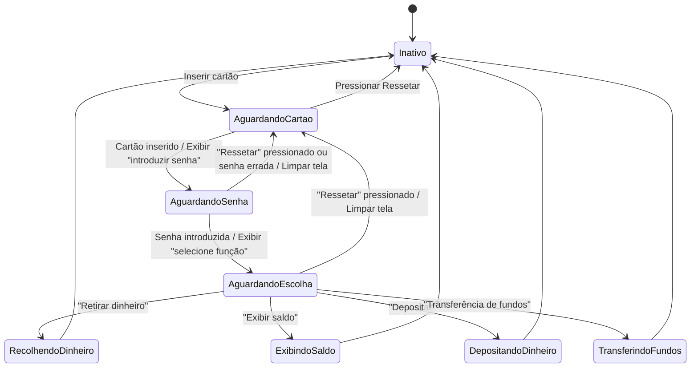
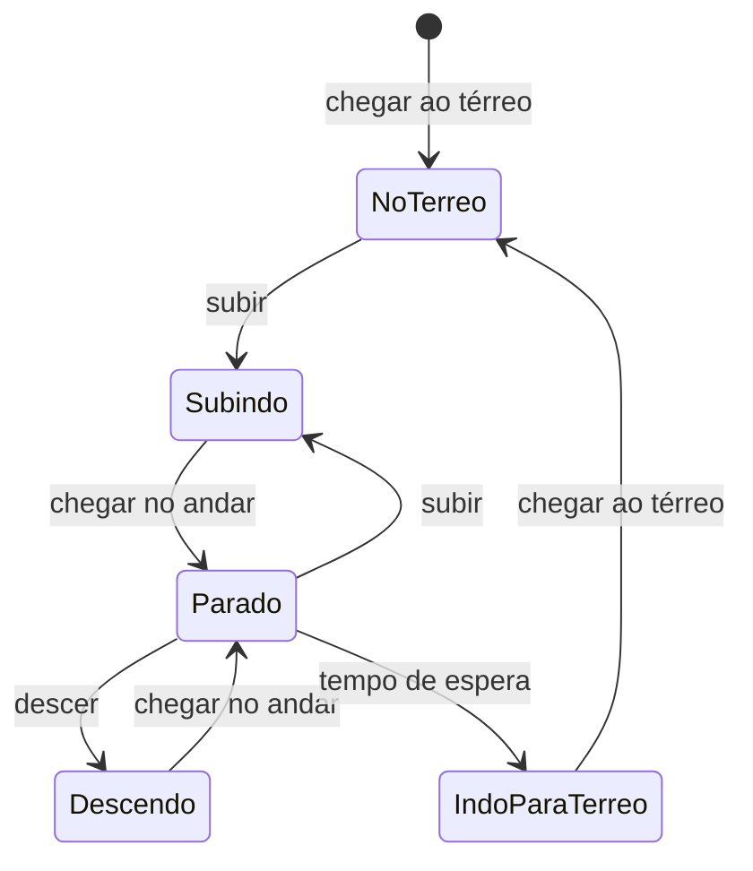
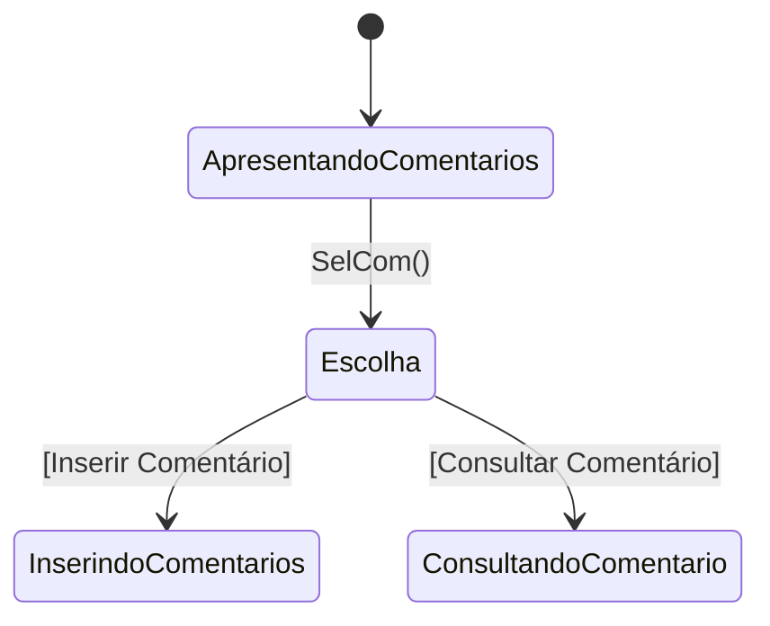
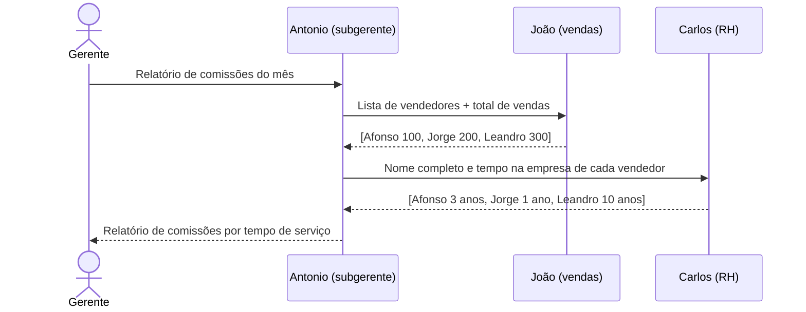
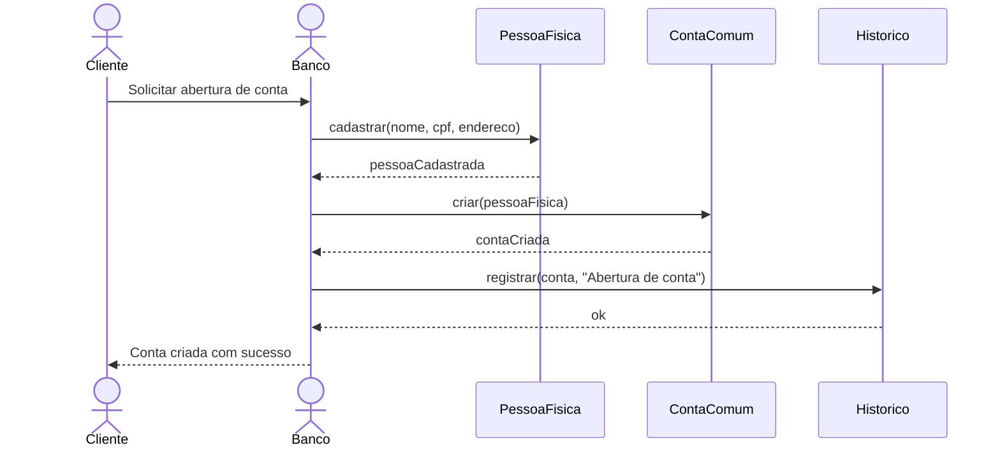
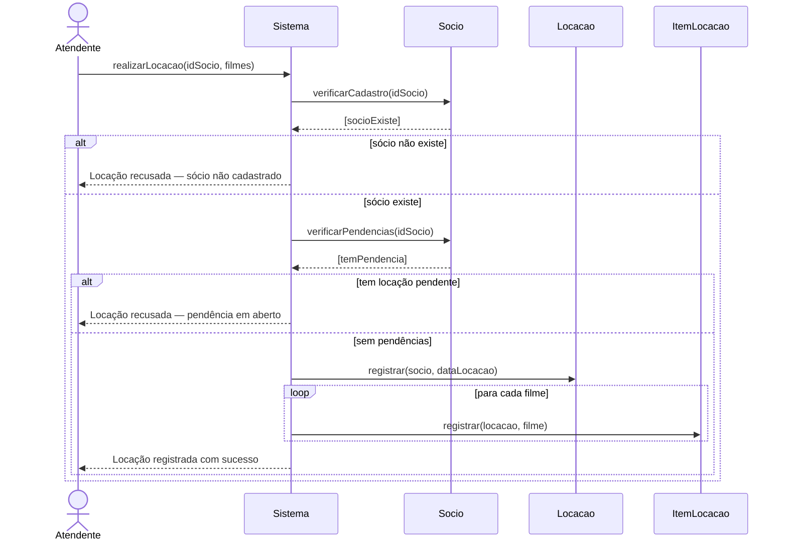
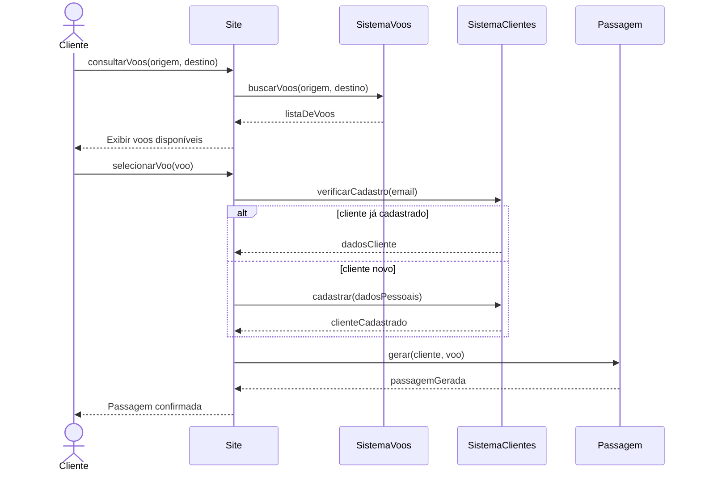

# UML na Prática: Diagrama de Estado e Diagrama de Sequência

Resumo de estudo baseado nas aulas de Análise e Projeto Orientado a Objetos (APOO) — UMFG.
Cobre os dois diagramas comportamentais mais usados na UML, com exemplos reais e diagramas renderizados.

---

## O que você vai encontrar aqui

| Diagrama | Para que serve |
|---|---|
| [Diagrama de Estado](#diagrama-de-estado) | Mostrar os estados que um objeto pode assumir ao longo do tempo |
| [Diagrama de Sequência](#diagrama-de-sequência) | Mostrar a ordem das mensagens trocadas entre objetos |

---

## Diagrama de Estado

### O que é

O Diagrama de Estado (ou Diagrama de Máquina de Estados) mostra como um **objeto se comporta ao longo do tempo** — quais situações ele pode estar e o que faz ele mudar de uma situação para outra.

**Quando usar:** quando um objeto do sistema pode estar em diferentes situações dependendo de eventos que acontecem — por exemplo, um pedido pode estar *pendente*, *aprovado*, *enviado* ou *cancelado*.

---

### Elementos principais

| Elemento | Símbolo | O que representa |
|---|---|---|
| Estado inicial | ● (círculo preto cheio) | Onde tudo começa |
| Estado final | ◎ (círculo com borda dupla) | Onde o ciclo termina |
| Estado | `[ Nome do Estado ]` | Situação atual do objeto |
| Transição | `──evento──►` | O que faz o objeto mudar de estado |
| Guarda | `[condição]` | Condição que precisa ser verdadeira para a transição acontecer |
| Ação | `/ ação()` | O que é executado quando a transição ocorre |

### Atividades internas de um estado

Dentro de cada estado, um objeto pode executar ações:

```
┌─────────────────────────┐
│  Nome do Estado         │
├─────────────────────────┤
│ entry / ao_entrar()     │  ← executa quando entra no estado
│ do    / enquanto_ativo()│  ← executa enquanto está no estado
│ exit  / ao_sair()       │  ← executa antes de sair do estado
└─────────────────────────┘
```

---

### Exemplo 1 — Usuário de um fórum

Um usuário passa por vários estados desde o cadastro até o cancelamento da conta.



**Leitura do diagrama:**
- Um novo usuário começa como **Pendente** até ser aprovado
- Uma vez **Liberado**, pode ser moderado, bloqueado ou cancelar por conta própria
- Bloqueado pela segunda vez → conta cancelada automaticamente (guarda `[segunda vez]`)

---

### Exemplo 2 — Conta bancária



**O que aprender com este exemplo:**
- A guarda `[6 meses sem movimento]` torna a transição automática — não precisa de evento externo
- A guarda `[30 dias]` funciona igual: após o prazo, o sistema avança sozinho
- A conta bloqueada por ordem judicial tem caminho próprio de desbloqueio

---

### Exemplo 3 — Caixa Eletrônico



---

### Exemplo 4 — Elevador



---

### Pseudo-estado de Escolha (Choice)

Quando o próximo estado depende de uma condição, usamos o **diamond** (◇) de escolha.
Uma transição entra e duas ou mais saem — cada saída tem sua guarda, e exatamente uma delas será verdadeira.



---

### Sintaxe da transição

```
evento [guarda] / ação
```

Exemplos:
```
Atender Pedido [Todos os itens selecionados] / Persiste
Item Adquirido [Não tem item disponível em estoque] / busca outro item
```

---

## Diagrama de Sequência

### O que é

O Diagrama de Sequência mostra **quem chama quem** e **em que ordem** dentro de um caso de uso.
Enquanto o Diagrama de Estado foca no ciclo de vida de um objeto, o de Sequência foca na **conversa entre vários objetos**.

**Tem duas dimensões:**
- **Horizontal** → os objetos participantes (quem é)
- **Vertical** → o tempo (o que acontece primeiro, segundo, terceiro...)

---

### Elementos principais

| Elemento | O que é |
|---|---|
| `obj:Classe` | Objeto participante (ex: `joao:Vendedor`) |
| Linha de vida (lifeline) | Linha vertical tracejada abaixo do objeto — representa o tempo |
| Foco de controle | Retângulo sobre a lifeline — indica que o objeto está executando algo |
| Mensagem (seta sólida →) | Chamada de operação de um objeto para outro |
| Retorno (seta tracejada -->) | Resposta da operação (opcional) |
| Criação | Seta que aponta para um novo objeto |
| Destruição | X no fim da lifeline |

### Sintaxe da mensagem

```
retorno := mensagem(parametro: Tipo): TipoRetorno
```

Exemplos:
```
listaVendedores := getVendedores(): List
total := calcularTotal(vendas): Double
```

### Tipos de mensagem

| Tipo | O que faz |
|---|---|
| `call` | Chama uma operação em outro objeto |
| `return` | Retorna o valor da operação (opcional no diagrama) |
| `create` | Cria um novo objeto |
| `destroy` | Elimina um objeto |

### Condições e repetição

```
[clienteExiste] mensagem()       → só envia se a condição for verdadeira
* mensagem()                     → envia repetidamente (iteração)
*[i=1..n] mensagem()            → repete n vezes
```

---

### Estereótipos de objetos

Ao montar o diagrama, os objetos são classificados em três tipos:

| Estereótipo | Símbolo | Para que serve |
|---|---|---|
| `<<boundary>>` | Interface | Tudo que faz fronteira com o mundo externo: telas, APIs, sistemas externos |
| `<<control>>` | Controle | Coordena o fluxo entre a interface e os dados |
| `<<entity>>` | Entidade | Armazena as informações (geralmente vira tabela no banco) |

---

### Como montar um Diagrama de Sequência

1. Escolha um caso de uso
2. Identifique os objetos que participam da interação
3. Identifique qual objeto inicia a interação
4. Liste as mensagens trocadas entre eles na ordem em que acontecem
5. Desenhe

---

### Exemplo 1 — Relatório de Comissões

Gerente pede relatório para o subgerente, que coleta dados de outros setores.



---

### Exemplo 2 — Abertura de Conta Bancária



---

### Exemplo 3 — Locação de Filmes



---

### Exemplo 4 — Venda de Passagens Aéreas



---

## Quando usar cada diagrama

| Situação | Use |
|---|---|
| Quero entender os estados que um objeto pode ter | Diagrama de Estado |
| Quero saber o que acontece se um objeto fica sem movimento por 6 meses | Diagrama de Estado |
| Quero entender quem chama quem dentro de um caso de uso | Diagrama de Sequência |
| Quero identificar quais classes são necessárias para um fluxo | Diagrama de Sequência |
| Quero modelar um processo com condições e repetições | Diagrama de Sequência |
| Quero mostrar o ciclo de vida completo de um pedido ou conta | Diagrama de Estado |

---

## Resumo dos elementos — lado a lado

### Diagrama de Estado

```
● ──────► [ Estado A ] ──evento [guarda] / ação──► [ Estado B ] ──► ◎
                │
                │ entry / inicializar()
                │ do    / processar()
                │ exit  / finalizar()
```

### Diagrama de Sequência

```
   :ObjetoA          :ObjetoB          :ObjetoC
       │                  │                  │
       │──mensagem()──────►│                  │
       │                  │──outraMensagem()──►│
       │                  │◄──────retorno()────│
       │◄─────retorno()───│                  │
```

---

## Referências

- Bezerra, E. **Princípios de Análise e Projeto de Sistemas com UML**. Elsevier, 2007.
- Booch, G.; Rumbaugh, J.; Jacobson, I. **UML: Guia do Usuário**. Campus, 2000.
- Melo, A. C. **Desenvolvendo Aplicações com UML 2.0**. Brasport, 2004.
- Guedes, G. T. A. **UML 2.0 Guia de Consulta Rápida**. 2ª ed. Novatec.
- Silva, R. P. **UML 2 em Modelagem Orientada a Objetos**. Visual Books, 2007.
