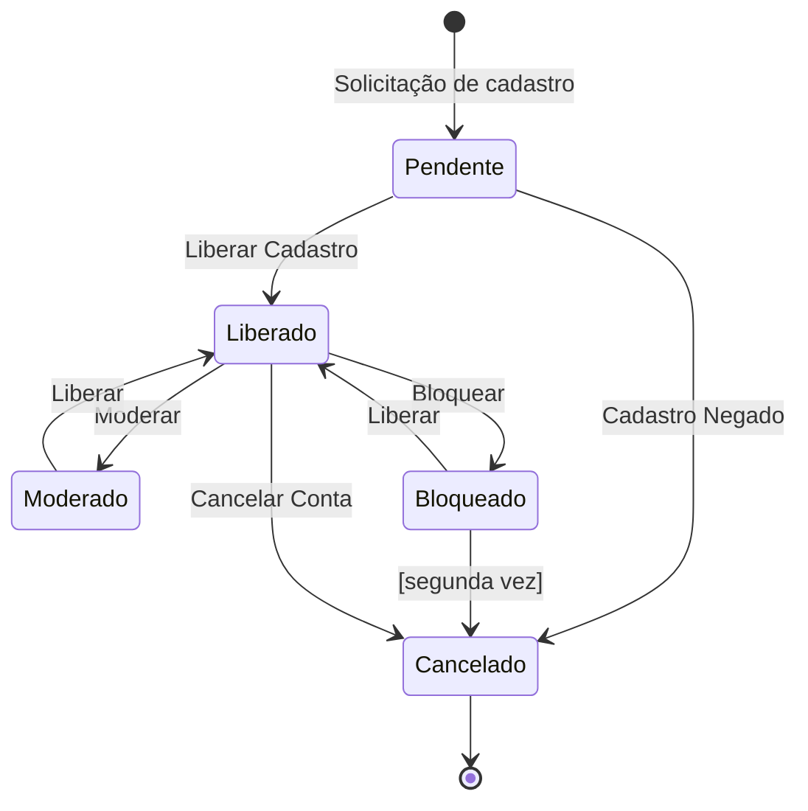
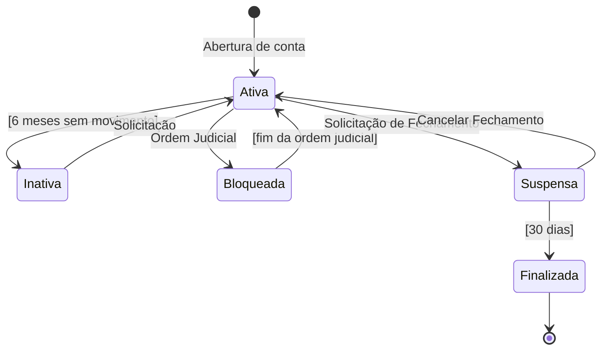
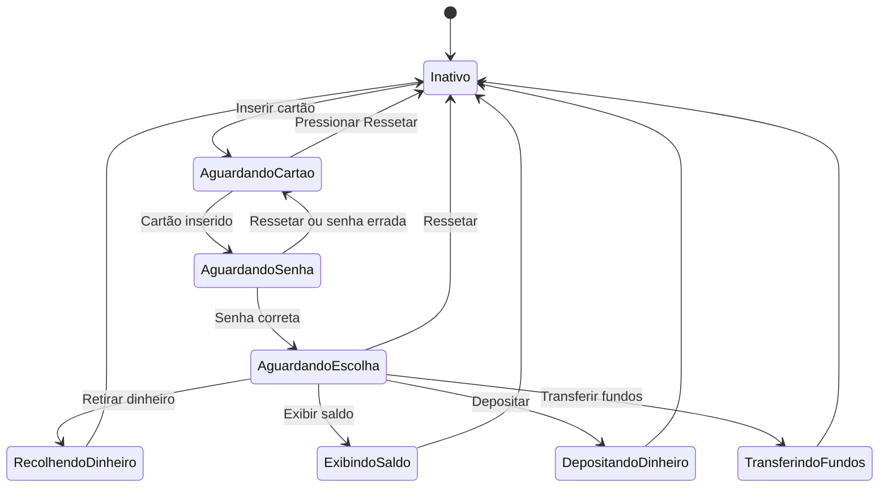
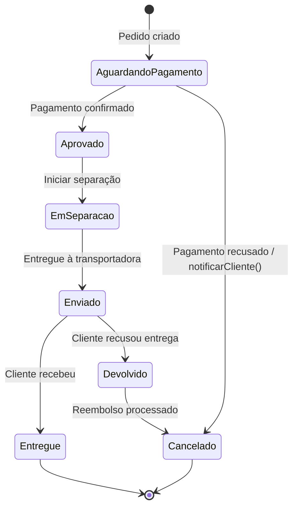

# Diagrama de Estado

## O que é

O Diagrama de Estado mostra as **situações que um objeto pode estar** ao longo do tempo e o que faz ele passar de uma situação para outra.

Pense em um pedido de e-commerce: ele começa *aguardando pagamento*, vai para *aprovado*, depois *enviado*, depois *entregue*. Cada uma dessas situações é um **estado**. O pagamento confirmado é o **evento** que faz ele sair de um estado e ir para o próximo.

---

## Elementos

### Estado
A situação atual do objeto. Representado por um retângulo arredondado.

```
╭─────────────────╮
│  Aguardando     │
│  Pagamento      │
╰─────────────────╯
```

Um estado pode ter **atividades internas** — ações que acontecem enquanto o objeto está nele:

```
╭──────────────────────────╮
│  Processando Pagamento   │
├──────────────────────────┤
│ entry / exibirCarregando │  ← executa ao entrar
│ do    / chamarAPI()      │  ← executa enquanto está aqui
│ exit  / ocultarLoading() │  ← executa ao sair
╰──────────────────────────╯
```

### Transição
A seta que conecta dois estados. Sempre tem um **evento** que a dispara.

```
[ Estado A ] ──── evento ────► [ Estado B ]
```

Pode ter também uma **guarda** (condição) e uma **ação**:

```
[ Estado A ] ──── evento [condição] / ação() ────► [ Estado B ]
```

Exemplo real:
```
[ Bloqueado ] ──── Bloquear [segunda vez] / notificarAdmin() ────► [ Cancelado ]
```

### Estado Inicial e Final

```
● ────► primeiro estado          (início — círculo preto cheio)
último estado ────► ◎            (fim — círculo com borda dupla)
```

### Pseudo-estado de Escolha (Choice)
Quando o próximo estado depende de uma condição, usamos um **losango**. Uma seta entra e duas ou mais saem — cada saída tem sua condição, e apenas uma será verdadeira.

```
                ◇
               / \
[condição A] /   \ [condição B]
            ▼     ▼
       [ Estado X ] [ Estado Y ]
```

---

## Exemplos

### Exemplo 1 — Usuário de um fórum

**O que observar:** um novo usuário começa como *Pendente* e precisa ser aprovado. Uma vez ativo, pode ser moderado, bloqueado ou cancelar a conta. Se for bloqueado pela segunda vez, a conta é cancelada automaticamente — isso é a guarda `[segunda vez]`.



---

### Exemplo 2 — Conta bancária

**O que observar:** a conta começa *Ativa*. Dois eventos a tornam *Inativa* e *Bloqueada* de formas diferentes — inatividade por tempo (guarda automática) e ordem judicial (evento externo). O caminho para fechar a conta passa por um estado intermediário (*Suspensa*) com prazo de 30 dias — isso protege o cliente de um fechamento imediato.



---

### Exemplo 3 — Caixa Eletrônico

**O que observar:** o caixa tem um estado *Inativo* que é sempre o ponto de retorno após qualquer operação ou erro. Note que o botão "Ressetar" aparece em dois estados diferentes (*AguardandoCartao* e *AguardandoSenha*) — o mesmo evento pode agir em estados diferentes. Ao chegar em *AguardandoEscolha*, o fluxo se divide em quatro operações independentes, todas voltando para *Inativo* no final.



---

### Exemplo 4 — Pedido de e-commerce

**O que observar:** esse é um exemplo criado para mostrar como ler o diagrama de ponta a ponta. Preste atenção nos dois caminhos que saem de *AguardandoPagamento* — um caminho feliz (aprovado) e um de falha (cancelado). O mesmo acontece em *Enviado*: pode chegar ou ser devolvido.



---

## Erros comuns

**Confundir evento com estado**
O estado é uma situação que dura no tempo. O evento é o que provoca a mudança.
- ❌ Estado: "Pagamento Confirmado"
- ✅ Estado: "Aguardando Envio" → evento que levou até aqui: "Pagamento Confirmado"

**Esquecer os caminhos de erro**
Todo diagrama deve ter pelo menos um caminho alternativo. Se o diagrama só tem o caminho feliz, ele está incompleto.

**Criar estados sem saída**
Todo estado (exceto o final) precisa ter pelo menos uma transição saindo dele. Se um estado não tem saída, o objeto fica "preso" — isso quase sempre é um erro de modelagem.

**Usar guarda onde deveria ser um estado separado**
Se uma condição aparece em muitas transições diferentes, provavelmente ela merece virar um estado próprio.
