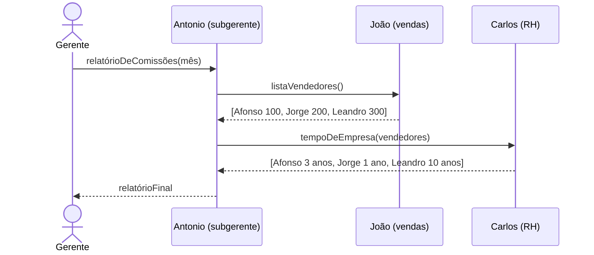
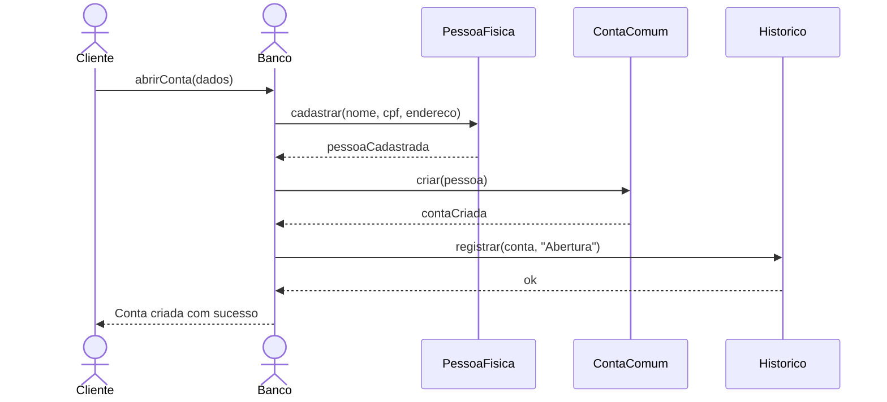
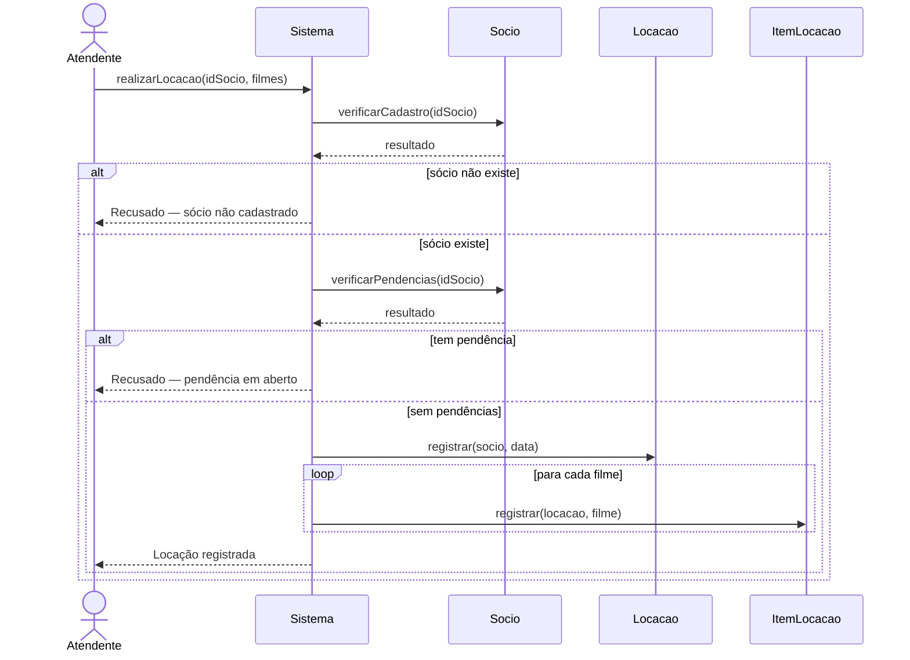
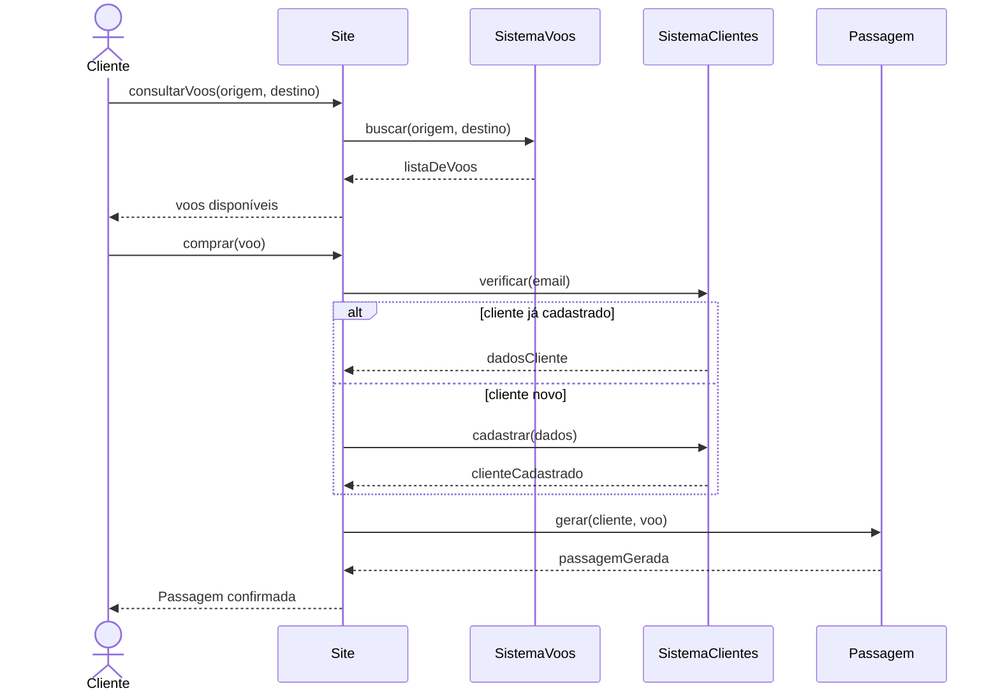

# Diagrama de Sequência

## O que é

O Diagrama de Sequência mostra **quem fala com quem e em que ordem** dentro de um caso de uso. Ele responde a pergunta: "para essa funcionalidade funcionar, qual objeto chama qual operação de qual outro objeto?"

É o diagrama mais usado para descobrir quais classes são necessárias — porque ao modelar as mensagens, você percebe quais operações cada classe precisa ter.

---

## Duas dimensões

```
   :Cliente     :Sistema     :Banco
       │             │           │
       │             │           │      ← dimensão horizontal
       │             │           │        (quem participa)
       ▼             ▼           ▼
     tempo         tempo       tempo    ← dimensão vertical
                                          (o que acontece primeiro)
```

- **Horizontal** → os objetos que participam da interação
- **Vertical** → o tempo — o que está mais acima acontece antes

---

## Elementos

### Objeto (lifeline)
Cada participante aparece no topo com o formato `nome:Classe`.

```
   joao:Vendedor       :Estoque        contrato:Pedido
         │                  │                │
         │                  │                │
```

Se não souber o nome do objeto, use só a classe: `:Estoque`
Se não souber a classe, use só o nome: `sistema`

### Foco de controle
Retângulo sobre a lifeline — indica que o objeto está executando algo naquele momento.

### Mensagem
Seta sólida de um objeto para outro. Representa uma chamada de operação.

```
:ObjetoA ──── nomeDoMetodo(parametro) ────► :ObjetoB
```

### Retorno
Seta tracejada de volta. É opcional — só coloque quando o retorno for importante para entender o fluxo.

```
:ObjetoA ◄──── resultado ──── :ObjetoB
```

### Condição (guarda)
Mensagem que só é enviada se uma condição for verdadeira.

```
[clienteExiste] buscarDados(id)
```

### Repetição (iteração)
Mensagem enviada várias vezes.

```
* registrarItem(item)           → repete para cada item
*[i=1..n] processar(lista[i])  → repete n vezes
```

### Criação e destruição de objeto
```
──── create ────► :NovoObjeto     (cria o objeto)
:Objeto ────► X                   (destrói o objeto)
```

---

## Estereótipos de objetos

Ao identificar os objetos, classifique cada um em um dos três tipos:

| Tipo | O que é | Exemplo |
|---|---|---|
| `<<boundary>>` | Interface com o mundo externo — telas, APIs, outros sistemas | Tela de login, API de pagamento |
| `<<control>>` | Coordena o fluxo entre a interface e os dados | ServicoDeLogin, ControladorPedido |
| `<<entity>>` | Armazena informações — geralmente vira tabela no banco | Cliente, Pedido, Produto |

---

## Como montar um Diagrama de Sequência

1. Escolha um caso de uso
2. Liste os objetos que participam
3. Identifique qual objeto inicia o fluxo
4. Escreva as mensagens na ordem em que acontecem
5. Adicione condições e repetições onde existirem

---

## Exemplos

### Exemplo 1 — Relatório de comissões

**O que observar:** o gerente faz um pedido para o subgerente, que precisa de informações de dois setores diferentes antes de poder responder. Perceba que as mensagens para João e Carlos poderiam acontecer em paralelo — mas no diagrama de sequência a ordem vertical representa sequência, não paralelismo (para paralelismo existe o `par`). O gerente só recebe a resposta depois que o subgerente juntou tudo.



---

### Exemplo 2 — Abertura de conta bancária

**O que observar:** o banco precisa cadastrar a pessoa física antes de criar a conta — a ordem importa. O Historico só é criado no final, depois que a conta existe. Se tentasse registrar antes de ter a conta, daria erro. Esse tipo de dependência de ordem fica muito claro no diagrama de sequência.



---

### Exemplo 3 — Locação de filmes

**O que observar:** existem dois pontos de decisão aqui — o sócio existe? e tem pendência? Cada um gera um caminho diferente. O bloco `alt/else` representa exatamente isso: caminhos alternativos. O `loop` representa a repetição para cada item da locação. Esses dois blocos (`alt` e `loop`) são as estruturas mais importantes do diagrama de sequência.



---

### Exemplo 4 — Venda de passagens aéreas

**O que observar:** o cliente pode ou não estar cadastrado — isso é o `alt/else`. Mas independente de estar ou não, o fluxo converge para o mesmo ponto: a geração da passagem. Esse padrão de "caminhos diferentes que se unem" é muito comum e importante de saber modelar.



---

## Erros comuns

**Colocar lógica de negócio nas mensagens**
O nome da mensagem deve ser o nome do método. A lógica fica dentro do objeto que recebe.
- ❌ `──── verificar se o cliente existe e tem mais de 18 anos ────►`
- ✅ `──── verificarElegibilidade(clienteId) ────►`

**Esquecer os caminhos alternativos**
Se um fluxo tem uma condição (`if`), o diagrama precisa mostrar o que acontece nos dois casos — o verdadeiro e o falso.

**Retornos desnecessários**
Não precisa colocar retorno em toda mensagem. Só coloque quando o valor retornado for usado nas próximas mensagens ou for importante para entender o fluxo.

**Objetos fazendo tudo**
Se um único objeto recebe e envia mensagens para todos os outros, provavelmente as responsabilidades estão mal distribuídas. O diagrama de sequência ajuda a perceber isso.

**Confundir com Diagrama de Atividades**
- Diagrama de Atividades → mostra o **fluxo do processo** (o que acontece)
- Diagrama de Sequência → mostra **quem faz o quê** (quais objetos e em que ordem)
